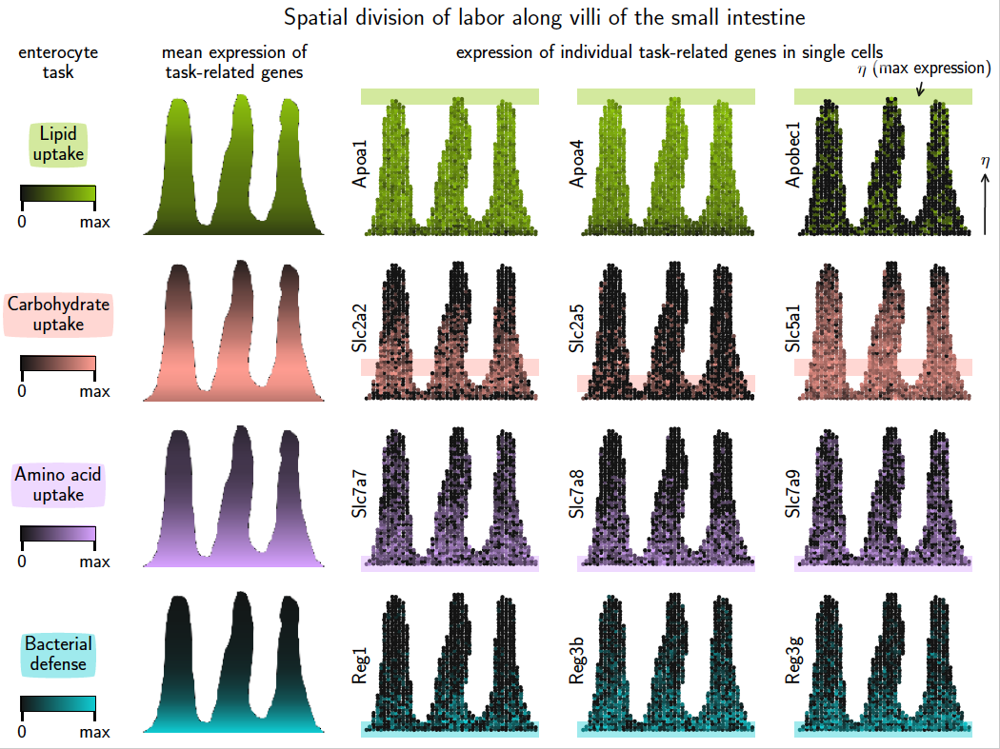

## bioembed: embedding biologial data into bio-inspired space
### 1) Spatial division of labor along villi of the small intestine

The small intestine is the main site of nutrient absorption in mammals. The intestinal epithelium is composed of finger-like protrusions, so-called villi, whose purpose is to increase the surface area available for nutrient uptake. Based on single-cell RNA sequencing data of mouse enterocytes (the absorptive cell type constituting the majority of the intestinal epithelium), a recent study showed that tasks such as lipid absorption and defense against microorganisms are not distributed evenly along these villi. Instead, the expression of more than 80\% of genes are zonated at the mRNA level and enterocytes assume specialized tasks according to their position on the villus axis [1].

While single-cell RNA sequencing (scRNAseq) has enabled many scientific breakthroughs in recent years, as of now there is no method allowing sequencing of single cells in situ, that is preserving full information about their tissue context. At times, however, spatial information can be reconstructed using additional experiments. In the work underlying this plot, Moor et al. extracted enterocyte landmark genes using laser capture microdissection. Based thereon, they assigned each individual cell a spatial coordinate eta ranging from 0 at the bottom of the villus to 1 at its tip [1].

Single-cell sequencing experiments yield high-dimensional data sets in which each cell is characterized by several thousands of gene dimensions. For visualization, such data is commonly embedded into two dimensions using methods such as t-Distributed Stochastic Neighbor Embedding (tSNE) or Uniform Manifold Approximation and Projection (UMAP).

Here, 1144 single enterocytes are embedded into a biologically inspired two-dimensional space – a cartoon of three intestinal villi – based on their villus coordinate eta. Using this embedding, the localization of four enterocyte tasks (absorption of lipids, carbohydrates and amino acids and defense against bacteria) is visualized. In the first column, colormaps show the combined expression of a group of genes related to each task averaged over eta. In the remaining columns, scatterplots in which each dot represents a cell and is colored according to its scRNAseq read-out of a specific gene are shown.

As biological datasets become more and more complex, plot designs which enable the viewer to grasp connected information quickly are in want. Tissue-inspired embeddings as proposed here allow to appreciate gene expression data in the context of tissue morphology at a single glance and are applicable to other single-cell data sets where spatial information is available.

[1] A. Moor et al. (2018), Cell 175(4), doi:10/gd87xq

_Technical information_: In the first column of villi panels, the color scale represents the fraction of unique molecular identifiers (UMI) associated with a group of task-related genes (lipid uptake: [Apoa1, Apoa4, Apobec1, Apob, Npc1l1], carbohydrate uptake: [Slc2a2, Slc2a5, Slc5a1], amino acid uptake: [Slc7a7, Slc7a8, Slc7a9], bacterial defense: [Reg1, Reg3b, Reg3g, Nlrp6, Lypd8, Il18, Ccl25]). Individual cells were grouped into 10 bins based on eta and gradients were constructed from group means by interpolation. In the remaining three columns, each dot represents one of 1144 unique enterocytes. For each gene, the color scale represents the logarithm of its UMI count after normalizing each cell to 10e4 total UMI counts. The horizontal position of a cell does not carry information. Horizontal bars indicate the position of the highest average expression of each gene between villus bottom and tip.
